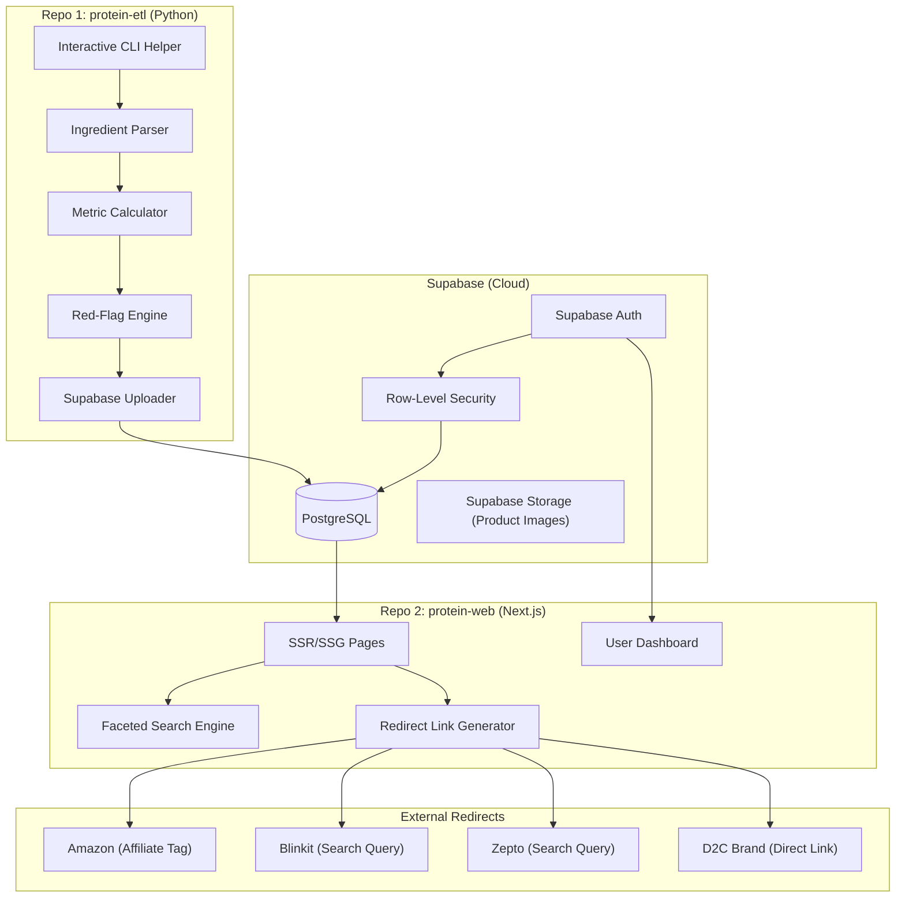
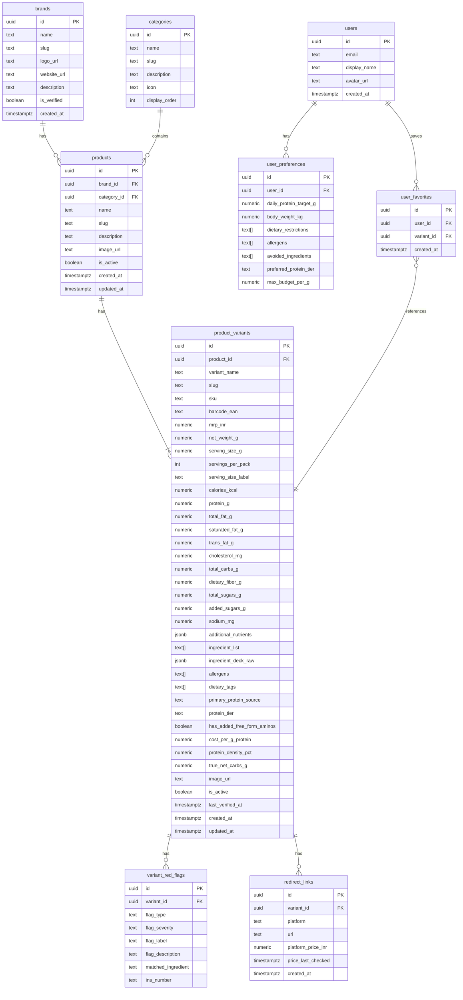
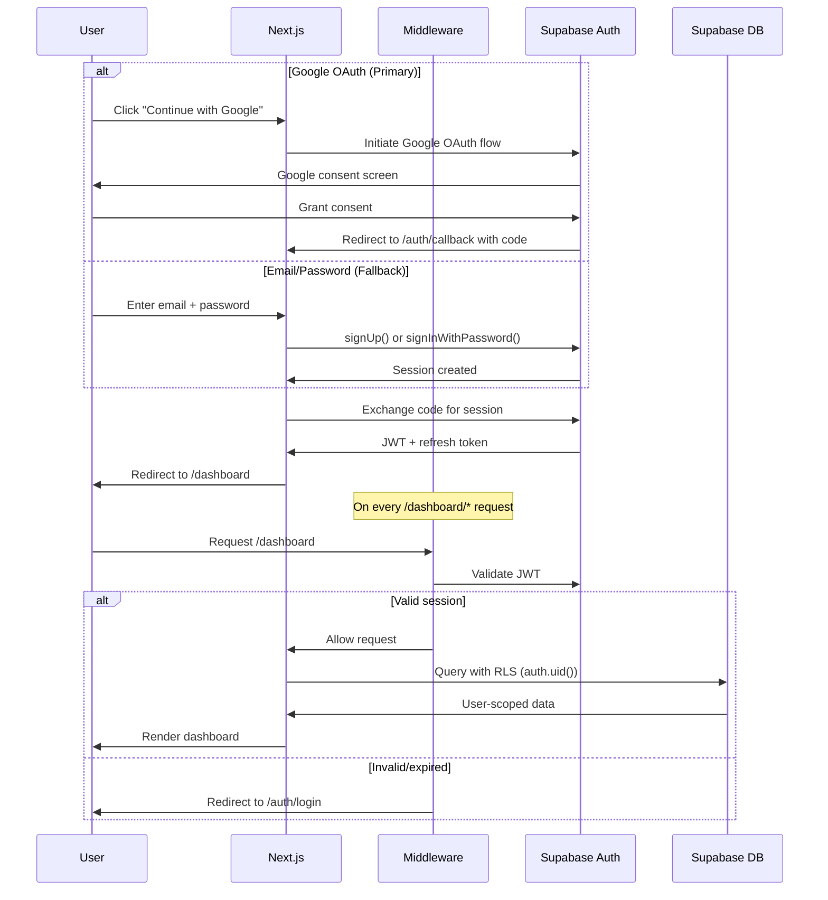

# Architecture: The Protein Discovery Engine

> [!NOTE]
> This is a living architecture document. It defines the system topology, data model, ingestion pipeline, frontend structure, and quality-flagging engine for an independent protein product comparison platform targeting the Indian market.

---

## 1. System Topology

The system is split into **two independent repositories** that communicate through a shared **Supabase** instance.



### Repo Boundaries

| Concern | Repo | Stack |
|---|---|---|
| Product data ingestion, parsing, metric calculation, upload | `protein-etl` | Python 3.11+, `httpx`, `beautifulsoup4`, `supabase-py` |
| Consumer-facing web app, search, auth, redirects | `protein-web` | Next.js 14+ (App Router), `@supabase/ssr`, TypeScript |
| Shared data layer, auth, file storage | Supabase (cloud) | PostgreSQL 15, Supabase Auth, Supabase Storage |

---

## 2. Database Schema (Supabase / PostgreSQL)

The data model uses a **parent-product → variant** hierarchy. Nutritional data lives on the variant (since different flavors/pack sizes have different macros). Red flags are computed and stored at the variant level.

### 2.1 Entity Relationship Diagram



### 2.2 Key Schema Design Decisions

| Decision | Rationale |
|---|---|
| **Nutrition on `product_variants`, not `products`** | A "Yoga Bar 20g Protein Bar" in Almond Fudge vs. Dark Cocoa has different macros, ingredients, and sometimes different prices. The variant is the atomic unit of truth. |
| **`ingredient_list` as `text[]` + `ingredient_deck_raw` as `jsonb`** | The `text[]` array is normalized (lowercase, trimmed) for fast red-flag scanning. The `jsonb` preserves the raw parsed structure with positions for audit trail. |
| **`allergens text[]` + `dietary_tags text[]` on variants** | The `user_preferences` table filters by `allergens` and `avoided_ingredients`. Without matching arrays on the product side, Step 1 of the recommendation engine ("remove products containing user's allergens") has no data to filter against. `allergens` holds values like `["milk", "soy", "tree nuts"]`. `dietary_tags` holds values like `["Vegan", "Keto", "Gluten-Free"]` — used for frontend tag-based filtering within broad categories. |
| **`serving_size_g` as strict numeric** | `net_weight_g` is the total pack weight. `serving_size_g` is the labeled single-serving weight. This allows the frontend to compute `per 100g` normalized macros on the fly: `(protein_g / net_weight_g) * 100`. Without a numeric serving size, comparison between a 30g bar and a 200ml shake is impossible. |
| **Computed metrics stored, not derived** | `cost_per_g_protein`, `protein_density_pct`, and `true_net_carbs_g` are pre-calculated during ETL and stored. This avoids runtime calculation on every query and enables indexed sorting/filtering. They are re-computed on any data update. |
| **`variant_red_flags` as separate table** | A variant can have 0–N flags. Storing them relationally enables filtering ("show me all products with zero red flags") and makes the flag engine extensible without schema changes. |
| **`protein_tier` as enum-like text** | Values: `"Tier 1 – Premium Isolate/Hydrolysate"`, `"Tier 2 – Concentrate/Casein/Egg"`, `"Tier 3 – Plant Blend (Pea/Rice/Soy)"`, `"Tier 4 – Filler-Heavy (Collagen/Gelatin/Wheat Gluten)"`. Stored as text for readability; enforced by the ETL script. |
| **`users` table mirrors Supabase Auth** | A public `users` table synced via a Supabase trigger on `auth.users` — holds display-facing profile data with RLS. |

### 2.3 Row-Level Security (RLS) Summary

| Table | Policy |
|---|---|
| `brands`, `categories`, `products`, `product_variants`, `variant_red_flags`, `redirect_links` | **Public read** for all (anon + authenticated). Write restricted to service role (ETL script). |
| `users` | Users can read/update **only their own row** (`auth.uid() = id`). |
| `user_preferences` | Users can CRUD **only their own preferences** (`auth.uid() = user_id`). |
| `user_favorites` | Users can CRUD **only their own favorites** (`auth.uid() = user_id`). |

### 2.4 Key Indexes

```sql
-- Core query patterns: filtering + sorting by efficiency metrics
CREATE INDEX idx_variants_cost_per_g ON product_variants (cost_per_g_protein) WHERE is_active = true;
CREATE INDEX idx_variants_protein_density ON product_variants (protein_density_pct DESC) WHERE is_active = true;
CREATE INDEX idx_variants_protein_tier ON product_variants (protein_tier) WHERE is_active = true;
CREATE INDEX idx_variants_product_id ON product_variants (product_id);
CREATE INDEX idx_products_category ON products (category_id) WHERE is_active = true;
CREATE INDEX idx_products_brand ON products (brand_id) WHERE is_active = true;
CREATE INDEX idx_red_flags_variant ON variant_red_flags (variant_id);
CREATE INDEX idx_red_flags_type ON variant_red_flags (flag_type);
CREATE INDEX idx_redirect_platform ON redirect_links (variant_id, platform);

-- Allergen & dietary tag filtering (enables recommendation engine Step 1)
CREATE INDEX idx_variants_allergens ON product_variants USING gin (allergens);
CREATE INDEX idx_variants_dietary_tags ON product_variants USING gin (dietary_tags);

-- Full-text search on product + variant names
CREATE INDEX idx_products_name_trgm ON products USING gin (name gin_trgm_ops);
CREATE INDEX idx_variants_name_trgm ON product_variants USING gin (variant_name gin_trgm_ops);
```

> [!IMPORTANT]
> The `pg_trgm` extension must be enabled in Supabase for trigram-based fuzzy search. This is a one-click toggle in the Supabase Dashboard → Database → Extensions.

---

## 3. Calculated Metrics Engine

All metrics are computed during ETL and stored on `product_variants`. The formulas operate on **per-pack** data (as specified).

### 3.1 Metric Definitions

```
┌─────────────────────────────────────────────────────────────────────┐
│  COST PER GRAM OF PROTEIN (₹/g)                                    │
│  ─────────────────────────────                                      │
│  Formula:  mrp_inr / protein_g                                      │
│  Example:  ₹150 bar / 20g protein = ₹7.50/g                        │
│  Use:      Lower is better. The primary economic efficiency metric. │
│  Edge:     If protein_g = 0, set to NULL (not applicable).          │
└─────────────────────────────────────────────────────────────────────┘

┌─────────────────────────────────────────────────────────────────────┐
│  PROTEIN DENSITY (% Calories from Protein)                          │
│  ─────────────────────────────────────────                          │
│  Formula:  (protein_g × 4) / calories_kcal × 100                    │
│  Example:  20g × 4 / 250 kcal × 100 = 32%                          │
│  Use:      Higher is better. Reveals calorie-efficient protein      │
│            sources vs. sugar/fat-padded products.                    │
│  Edge:     If calories_kcal = 0, set to NULL.                       │
└─────────────────────────────────────────────────────────────────────┘

┌─────────────────────────────────────────────────────────────────────┐
│  TRUE NET CARBS (g)                                                 │
│  ─────────────────                                                  │
│  Formula:  total_carbs_g − dietary_fiber_g − non_glycemic_polyols_g │
│  Note:     FSSAI panels don't always break out polyols. When absent,│
│            true_net_carbs = total_carbs_g − dietary_fiber_g          │
│  Use:      Critical for keto/diabetic users.                        │
└─────────────────────────────────────────────────────────────────────┘
```

---

## 4. Red-Flag Engine

The red-flag engine scans the `ingredient_list` array against a **curated alias dictionary** that maps common ingredient names, their FSSAI-mandated INS numbers, and known aliases to canonical flag categories.

### 4.1 The Four Core Red Flags

| # | Flag Type | Trigger | Severity | Badge |
|---|---|---|---|---|
| 1 | `maltitol_alert` | Ingredient list contains maltitol, maltitol syrup, hydrogenated glucose syrup, or INS 965 | 🔴 High | "Maltitol Detected — GI 35-52" |
| 2 | `amino_spiking` | Ingredient list contains free-form glycine, taurine, or non-protein-bound L-glutamine in a protein product | 🟠 Amber | "Added Aminos Detected" |
| 3 | `fat_quality` | Ingredient list contains palm oil, palmolein, hydrogenated vegetable oil/fat, partially hydrogenated oil, interesterified fat, or INS 432-436 (polysorbates often co-occurring) | 🔴 High | "Palm Oil / Hydrogenated Fat" |
| 4 | `hidden_sugars` | Ingredient list contains high-fructose corn syrup (HFCS), dextrose, maltodextrin (INS 1400), corn syrup solids, invert sugar, or rice syrup despite "sugar-free" or "no added sugar" marketing claims | 🟠 Amber | "Hidden Sugar Source Detected" |

### 4.2 Curated Alias Dictionary Structure

```python
RED_FLAG_DICTIONARY = {
    "maltitol_alert": {
        "severity": "high",
        "badge_label": "Maltitol Detected — GI 35-52",
        "tooltip": "Maltitol has a Glycemic Index of 35-52, significantly higher than erythritol (0) or stevia (0). Often used in 'sugar-free' products marketed to diabetics.",
        "aliases": [
            {"canonical": "Maltitol", "ins": "INS 965(i)", "variants": ["maltitol", "maltitol syrup", "hydrogenated maltose syrup"]},
            {"canonical": "Maltitol Syrup", "ins": "INS 965(ii)", "variants": ["maltitol syrup", "hydrogenated glucose syrup", "lycasin"]},
        ]
    },
    "amino_spiking": {
        "severity": "amber",
        "badge_label": "Added Aminos Detected",
        "tooltip": "Free-form amino acids (glycine, taurine, glutamine) inflate the nitrogen count used to measure protein, without providing the same muscle-building benefit as intact protein.",
        "aliases": [
            {"canonical": "Glycine", "ins": None, "variants": ["glycine", "l-glycine", "aminoacetic acid"]},
            {"canonical": "Taurine", "ins": None, "variants": ["taurine", "2-aminoethanesulfonic acid"]},
            {"canonical": "L-Glutamine", "ins": None, "variants": ["l-glutamine", "glutamine"]},
        ]
    },
    "fat_quality": {
        "severity": "high",
        "badge_label": "Palm Oil / Hydrogenated Fat",
        "tooltip": "Hydrogenated and partially hydrogenated oils contain trans fats linked to cardiovascular disease. Palm oil, while trans-fat-free, raises LDL cholesterol and has environmental concerns.",
        "aliases": [
            {"canonical": "Palm Oil", "ins": None, "variants": ["palm oil", "palmolein oil", "refined palm oil", "palm fat", "palm kernel oil", "palm olein"]},
            {"canonical": "Hydrogenated Vegetable Oil", "ins": None, "variants": ["hydrogenated vegetable oil", "hydrogenated vegetable fat", "partially hydrogenated oil", "partially hydrogenated vegetable oil", "vanaspati", "interesterified fat", "interesterified vegetable fat"]},
        ]
    },
    "hidden_sugars": {
        "severity": "amber",
        "badge_label": "Hidden Sugar Source Detected",
        "tooltip": "These ingredients are functionally equivalent to sugar but may not appear in the 'Added Sugars' line on the nutrition panel. They spike blood glucose similarly to table sugar.",
        "aliases": [
            {"canonical": "Maltodextrin", "ins": "INS 1400", "variants": ["maltodextrin", "corn maltodextrin", "tapioca maltodextrin"]},
            {"canonical": "Dextrose", "ins": None, "variants": ["dextrose", "dextrose monohydrate", "d-glucose"]},
            {"canonical": "High Fructose Corn Syrup", "ins": None, "variants": ["high fructose corn syrup", "hfcs", "glucose-fructose syrup", "isoglucose"]},
            {"canonical": "Corn Syrup Solids", "ins": None, "variants": ["corn syrup solids", "corn syrup", "glucose syrup"]},
            {"canonical": "Invert Sugar", "ins": None, "variants": ["invert sugar", "invert sugar syrup", "inverted sugar"]},
            {"canonical": "Rice Syrup", "ins": None, "variants": ["rice syrup", "brown rice syrup", "rice malt syrup"]},
        ]
    }
}
```

### 4.3 Protein Tier Classification

The ETL script inspects the **ingredient deck** and identifies the protein sources listed. The **first protein source** encountered (by ingredient position, which reflects descending weight order per FSSAI regulations) becomes the `primary_protein_source`. The overall tier is assigned based on the **lowest-quality protein source present** in the blend.

| Tier | Label | Protein Sources |
|---|---|---|
| Tier 1 | Premium Isolate / Hydrolysate | Whey Protein Isolate (WPI), Whey Protein Hydrolysate, Micellar Casein Isolate |
| Tier 2 | Concentrate / Casein / Egg | Whey Protein Concentrate (WPC), Milk Protein Concentrate (MPC), Casein, Calcium Caseinate, Egg White Protein, Egg Albumin |
| Tier 3 | Plant Blend | Pea Protein Isolate, Brown Rice Protein, Soy Protein Isolate, Hemp Protein |
| Tier 4 | Filler-Heavy | Collagen, Gelatin, Hydrolyzed Collagen, Wheat Gluten, Soy Protein Concentrate (low BV), Amino-spiked blends |

> [!TIP]
> The tier represents the **weakest link** in the protein blend. A product with "Whey Isolate, Whey Concentrate, **Collagen**" would be classified as **Tier 4** because collagen is present. The `primary_protein_source` would still correctly show "Whey Protein Isolate" — giving the user both the headline source and the structural truth.

---

## 5. Python ETL Pipeline (`protein-etl`)

### 5.1 Project Structure

```
protein-etl/
├── pyproject.toml
├── .env                          # SUPABASE_URL, SUPABASE_SERVICE_KEY
├── src/
│   ├── __init__.py
│   ├── cli.py                    # Interactive CLI entry point
│   ├── models.py                 # Pydantic models for Product, Variant, Nutrition
│   ├── parsers/
│   │   ├── __init__.py
│   │   ├── shopify.py            # Shopify /products.json extractor
│   │   ├── amazon.py             # Amazon PDP extractor (future)
│   │   └── manual.py             # Interactive manual entry with prompts
│   ├── engine/
│   │   ├── __init__.py
│   │   ├── metrics.py            # ₹/g, protein density, net carbs calculators
│   │   ├── red_flags.py          # Alias dictionary + flag scanner
│   │   └── protein_tier.py       # Protein source classifier
│   ├── db/
│   │   ├── __init__.py
│   │   └── supabase_client.py    # Supabase upload/upsert logic
│   └── data/
│       ├── red_flag_dictionary.json
│       └── protein_sources.json
├── tests/
│   ├── test_metrics.py
│   ├── test_red_flags.py
│   └── test_protein_tier.py
└── README.md
```

### 5.2 CLI Workflow (Human-in-the-Loop)

The CLI is **not** a fully automated background pipeline. It is an interactive helper that does the heavy typing while keeping you in control.

```
┌──────────────────────────────────────────────────────────────────┐
│                    INTERACTIVE CLI SESSION                        │
├──────────────────────────────────────────────────────────────────┤
│                                                                  │
│  Step 1: SOURCE SELECTION                                        │
│  ┌──────────────────────────────────────────────────────────┐    │
│  │  ? How do you want to add this product?                  │    │
│  │    > [1] Shopify URL (auto-extract from /products.json)  │    │
│  │      [2] Amazon URL (semi-auto, needs manual confirm)    │    │
│  │      [3] Manual entry (guided prompts)                   │    │
│  └──────────────────────────────────────────────────────────┘    │
│                            │                                     │
│                            ▼                                     │
│  Step 2: DATA EXTRACTION                                         │
│  ┌──────────────────────────────────────────────────────────┐    │
│  │  Fetching from thewholetruth.co/products.json...         │    │
│  │  Found: "The Whole Truth Protein Bar - Peanut Cocoa"     │    │
│  │  MRP: ₹150 | Weight: 52g | Variants: 6 flavors          │    │
│  │                                                          │    │
│  │  ? Confirm product name: [The Whole Truth Protein Bar]   │    │
│  │  ? Enter nutrition per pack:                             │    │
│  │    Calories (kcal): [212]                                │    │
│  │    Protein (g): [20]                                     │    │
│  │    Total Fat (g): [8]                                    │    │
│  │    ...                                                   │    │
│  └──────────────────────────────────────────────────────────┘    │
│                            │                                     │
│                            ▼                                     │
│  Step 3: INGREDIENT PASTE                                        │
│  ┌──────────────────────────────────────────────────────────┐    │
│  │  ? Paste the full ingredient list from the pack:         │    │
│  │  > Whey Protein Isolate, Almonds, Chicory Root Fiber,    │    │
│  │    Cocoa Butter, Dark Chocolate (Cocoa Mass, Sugar),     │    │
│  │    Milk Solids, Natural Flavors                          │    │
│  └──────────────────────────────────────────────────────────┘    │
│                            │                                     │
│                            ▼                                     │
│  Step 4: AUTO-COMPUTE & FLAG                                     │
│  ┌──────────────────────────────────────────────────────────┐    │
│  │  ══════ COMPUTED METRICS ══════                          │    │
│  │  Cost per g Protein:    ₹7.50/g                          │    │
│  │  Protein Density:       37.7%                            │    │
│  │  True Net Carbs:        14g                              │    │
│  │                                                          │    │
│  │  ══════ RED FLAGS ══════                                 │    │
│  │  ✅ No maltitol detected                                 │    │
│  │  ✅ No amino spiking detected                            │    │
│  │  ✅ No palm oil / hydrogenated fat                       │    │
│  │  ✅ No hidden sugars detected                            │    │
│  │                                                          │    │
│  │  ══════ PROTEIN PROFILE ══════                           │    │
│  │  Primary Source:  Whey Protein Isolate                   │    │
│  │  Protein Tier:    Tier 1 – Premium Isolate               │    │
│  │  Free-Form Aminos: No                                    │    │
│  └──────────────────────────────────────────────────────────┘    │
│                            │                                     │
│                            ▼                                     │
│  Step 5: CONFIRM & UPLOAD                                        │
│  ┌──────────────────────────────────────────────────────────┐    │
│  │  ? Upload to Supabase? [Y/n]                             │    │
│  │  ✅ Uploaded: product_variants.id = abc-123-def           │    │
│  │                                                          │    │
│  │  ? Add redirect links?                                   │    │
│  │    Amazon URL: [https://amzn.in/...]                     │    │
│  │    D2C URL: [https://thewholetruth.co/...]               │    │
│  │  ✅ Redirect links saved.                                 │    │
│  └──────────────────────────────────────────────────────────┘    │
│                                                                  │
└──────────────────────────────────────────────────────────────────┘
```

### 5.3 Key Python Dependencies

```
httpx >= 0.27          # Async HTTP for Shopify/web fetching
beautifulsoup4 >= 4.12 # HTML parsing for product pages
pydantic >= 2.0        # Data validation & serialization
supabase >= 2.0        # Supabase Python client
rich >= 13.0           # Beautiful CLI output (tables, prompts, progress)
questionary >= 2.0     # Interactive CLI prompts
python-dotenv >= 1.0   # .env file loading
pytest >= 8.0          # Testing
```

---

## 6. Next.js Frontend (`protein-web`)

### 6.1 Project Structure

```
protein-web/
├── package.json
├── next.config.ts
├── tsconfig.json
├── .env.local                    # NEXT_PUBLIC_SUPABASE_URL, NEXT_PUBLIC_SUPABASE_ANON_KEY
├── public/
│   ├── fonts/
│   └── images/
├── src/
│   ├── app/
│   │   ├── layout.tsx            # Root layout (global nav, footer, fonts)
│   │   ├── page.tsx              # Landing / hero page
│   │   ├── globals.css
│   │   ├── explore/
│   │   │   └── page.tsx          # Filterable product grid (main discovery page)
│   │   ├── product/
│   │   │   └── [slug]/
│   │   │       └── page.tsx      # Product detail (variants, macros, flags, redirects)
│   │   ├── category/
│   │   │   └── [slug]/
│   │   │       └── page.tsx      # Category-specific listing (SSG for SEO)
│   │   ├── search/
│   │   │   └── page.tsx          # Search results page
│   │   ├── dashboard/
│   │   │   ├── layout.tsx        # Protected layout (requires auth)
│   │   │   ├── page.tsx          # User dashboard (recommendations, favorites)
│   │   │   └── preferences/
│   │   │       └── page.tsx      # Dietary preferences form
│   │   ├── auth/
│   │   │   ├── login/
│   │   │   │   └── page.tsx
│   │   │   ├── signup/
│   │   │   │   └── page.tsx
│   │   │   └── callback/
│   │   │       └── route.ts      # Supabase Auth callback handler
│   │   └── api/
│   │       └── og/
│   │           └── route.tsx     # Dynamic OG image generation for social sharing
│   ├── components/
│   │   ├── ui/                   # Design system primitives
│   │   │   ├── Button.tsx
│   │   │   ├── Badge.tsx
│   │   │   ├── Card.tsx
│   │   │   ├── Input.tsx
│   │   │   ├── Tooltip.tsx
│   │   │   └── ...
│   │   ├── product/
│   │   │   ├── ProductCard.tsx       # Card in grid view
│   │   │   ├── ProductDetail.tsx     # Full product page component
│   │   │   ├── NutritionPanel.tsx    # Macro breakdown display
│   │   │   ├── NutritionToggle.tsx   # "Per Pack" / "Per 100g" toggle switch
│   │   │   ├── RedFlagBadges.tsx     # Red flag badge row
│   │   │   ├── ProteinTierBadge.tsx  # Tier 1-4 visual badge
│   │   │   ├── EfficiencyMeter.tsx   # ₹/g and density visual
│   │   │   └── RedirectButtons.tsx   # Platform CTAs with conditional price display
│   │   ├── search/
│   │   │   ├── SearchBar.tsx         # Global autocomplete search
│   │   │   ├── FilterPanel.tsx       # Faceted filters sidebar
│   │   │   └── SortDropdown.tsx      # Sort by ₹/g, density, price
│   │   ├── layout/
│   │   │   ├── Navbar.tsx
│   │   │   ├── Footer.tsx
│   │   │   └── MobileNav.tsx
│   │   └── dashboard/
│   │       ├── RecommendationFeed.tsx
│   │       └── FavoritesList.tsx
│   ├── lib/
│   │   ├── supabase/
│   │   │   ├── client.ts         # Browser Supabase client
│   │   │   ├── server.ts         # Server-side Supabase client
│   │   │   └── middleware.ts     # Auth middleware helper
│   │   ├── redirect.ts           # Redirect URL builder (Amazon, Blinkit, Zepto, D2C)
│   │   ├── constants.ts          # Categories, sort options, tier labels
│   │   └── utils.ts              # Formatters (₹, %, g)
│   ├── hooks/
│   │   ├── useSearch.ts
│   │   ├── useFilters.ts
│   │   └── useUser.ts
│   └── types/
│       ├── product.ts            # TypeScript types mirroring DB schema
│       └── user.ts
├── middleware.ts                  # Next.js middleware for protected routes
└── README.md
```

### 6.2 Page Architecture & Data Fetching Strategy

| Page | Route | Rendering | Data Source |
|---|---|---|---|
| Landing | `/` | SSG | Static content + top products (revalidate 24h) |
| Explore (main grid) | `/explore` | SSR with client-side filtering | Server-fetch initial set, client-side Supabase queries for filters/sort |
| Product Detail | `/product/[slug]` | SSG with ISR (revalidate 1h) | `generateStaticParams` from all active products |
| Category | `/category/[slug]` | SSG with ISR | Pre-rendered per category |
| Search Results | `/search?q=...` | SSR | Supabase full-text search |
| Dashboard | `/dashboard` | SSR (protected) | User-specific queries behind RLS |
| Auth pages | `/auth/*` | SSR | Supabase Auth |

### 6.3 Redirect URL Builder & Price Display Rules

Prices are displayed **only** for platforms where stored data is reliable (Amazon, D2C). Quick-commerce prices are dynamic and pincode-dependent — displaying stale prices would erode trust.

| Platform | URL Strategy | Price Display |
|---|---|---|
| **Amazon** | Stored canonical URL + affiliate tag | Show `platform_price_inr` (e.g., "₹149 on Amazon") |
| **D2C Brand** | Stored direct product URL | Show `platform_price_inr` (e.g., "₹135 on Brand Store") |
| **Blinkit** | Dynamic search query URL | "Check Local Price →" (no price shown) |
| **Zepto** | Dynamic search query URL | "Check Local Price →" (no price shown) |
| **Instamart** | Dynamic search query URL | "Check Local Price →" (no price shown) |

```typescript
// lib/redirect.ts
type Platform = 'amazon' | 'blinkit' | 'zepto' | 'instamart' | 'd2c';
type PriceDisplay = { type: 'stored'; price: number } | { type: 'check_local' };

interface RedirectLink {
  platform: Platform;
  url: string;
  priceDisplay: PriceDisplay;
  label: string; // "Amazon", "Blinkit", "Zepto", "Instamart", brand name
}

const QUICK_COMMERCE_PLATFORMS = ['blinkit', 'zepto', 'instamart'] as const;

function buildRedirectUrl(platform: Platform, ctx: {
  brandName: string;
  productName: string;
  directUrl?: string;
}): string {
  switch (platform) {
    case 'amazon':
      return ctx.directUrl ? `${ctx.directUrl}?tag=YOUR_AFFILIATE_TAG` : '#';
    case 'blinkit':
      return `https://blinkit.com/s/?q=${encodeURIComponent(`${ctx.brandName} ${ctx.productName}`)}`;
    case 'zepto':
      return `https://www.zeptonow.com/search?query=${encodeURIComponent(`${ctx.brandName} ${ctx.productName}`)}`;
    case 'instamart':
      return `https://www.swiggy.com/instamart/search?query=${encodeURIComponent(`${ctx.brandName} ${ctx.productName}`)}`;
    case 'd2c':
      return ctx.directUrl || '#';
  }
}

function getPriceDisplay(platform: Platform, storedPrice?: number): PriceDisplay {
  if (QUICK_COMMERCE_PLATFORMS.includes(platform as any)) {
    return { type: 'check_local' };
  }
  return storedPrice ? { type: 'stored', price: storedPrice } : { type: 'check_local' };
}
```
```

### 6.4 SEO Strategy

| SEO Element | Implementation |
|---|---|
| **Title tags** | Dynamic: `"{Product Name} – Nutrition Facts, Red Flags & Best Price | [SiteName]"` |
| **Meta descriptions** | Auto-generated from macros: `"{Product Name}: {protein_g}g protein, ₹{cost_per_g}/g, {protein_density}% protein density. {flag_count} red flags. Compare prices on Amazon, Blinkit, Zepto."` |
| **Open Graph images** | Dynamic OG images via `/api/og` route showing product card with key metrics |
| **Structured data** | JSON-LD `Product` schema with `NutritionInformation` for rich snippets |
| **Sitemap** | Auto-generated `sitemap.xml` from all active product slugs |
| **Category pages** | SSG pages targeting long-tail keywords: "best protein bars without maltitol India", "cheapest whey protein per gram" |

---

## 7. Personalization Engine (User Dashboard)

### 7.1 Recommendation Logic

The recommendation engine is **rule-based** (no ML needed at this scale). It queries `product_variants` using data from `user_preferences`, leveraging the `allergens` and `dietary_tags` arrays now present on both sides.

```
1. FILTER: Remove variants where variant.allergens overlaps with user.allergens
          SQL: NOT (pv.allergens && user_prefs.allergens)
2. FILTER: Remove variants containing any of user's avoided_ingredients
          SQL: NOT (pv.ingredient_list && user_prefs.avoided_ingredients)
3. FILTER: Remove variants outside user's budget
          SQL: pv.cost_per_g_protein <= user_prefs.max_budget_per_g
4. FILTER: Match preferred protein tier if set
          SQL: pv.protein_tier = user_prefs.preferred_protein_tier
5. RANK:   Sort by protein_density_pct DESC (most efficient first)
6. BOOST:  Variants with 0 red flags get a priority boost
          SQL: LEFT JOIN variant_red_flags, ORDER BY flag_count ASC
7. LIMIT:  Return top 20 recommendations
```

> [!TIP]
> The `&&` operator in PostgreSQL checks for array overlap — it returns `true` if the two arrays share any element. This is why both `product_variants.allergens` and `user_preferences.allergens` must be `text[]` arrays with a shared vocabulary (e.g., `"milk"`, `"soy"`, `"tree_nuts"`, `"gluten"`).

### 7.2 Auth Flow

**Auth providers:** Google OAuth (primary, one-click) + Email/Password (fallback). Google OAuth is the default CTA — forced email verification drops conversion significantly in the Indian consumer space.



> [!NOTE]
> **Supabase Auth setup:** Enable Google OAuth in Supabase Dashboard → Authentication → Providers → Google. Requires a Google Cloud OAuth 2.0 Client ID and Client Secret. The callback URL is `https://<supabase-project>.supabase.co/auth/v1/callback`.

---

## 8. Development & Deployment Phases

### Phase 1A — Foundation (Current Priority)

| # | Task | Deliverable |
|---|---|---|
| 1 | Set up Supabase project | Database with schema, RLS policies, indexes |
| 2 | Set up `protein-etl` repo | Python project with CLI skeleton |
| 3 | Build metric calculator + red-flag engine | Tested `metrics.py`, `red_flags.py`, `protein_tier.py` |
| 4 | Build interactive CLI | Working product entry → compute → upload flow |
| 5 | Seed 10-20 products | Real data in Supabase for frontend development |

### Phase 1B — Frontend

| # | Task | Deliverable |
|---|---|---|
| 6 | Set up `protein-web` repo | Next.js 14 project with Supabase integration |
| 7 | Build design system | UI primitives, color tokens, typography |
| 8 | Build Explore page | Filterable product grid with sort/search |
| 9 | Build Product Detail page | Full nutrition panel, red flags, redirect buttons |
| 10 | Build Auth + Dashboard | Login, preferences, favorites, recommendations |

### Phase 1C — Polish & Launch

| # | Task | Deliverable |
|---|---|---|
| 11 | SEO optimization | Sitemaps, OG images, structured data |
| 12 | Mobile responsiveness pass | Fully responsive across breakpoints |
| 13 | Seed remaining products (75-100 total) | Complete initial catalog |
| 14 | Deploy frontend | Production deployment (hosting TBD) |

---

## 9. Resolved Design Decisions

The following questions were raised during architecture review and have been resolved:

| # | Question | Decision | Impact |
|---|---|---|---|
| 1 | **Auth provider** | Google OAuth (primary) + Email/Password (fallback) | Google one-click is the default CTA. Email/password is available but secondary. Avoids the conversion drop from forced email verification. |
| 2 | **Category granularity** | 4 broad categories only: RTD Dairy/Drinks, Protein Bars, Protein Powders, Savory Snacks | Finer distinctions (e.g., "Peanut Butter", "Cookies") are handled via `dietary_tags` on `product_variants` and rendered as filterable frontend tags within each category. Top-level nav stays clean and populated. |
| 3 | **Serving size display** | Per Pack (primary default) + Per 100g toggle | The `NutritionPanel` component shows per-pack macros by default. A `NutritionToggle` switch computes per-100g values on the fly using `serving_size_g`. Formula: `(nutrient_value / net_weight_g) * 100`. |
| 4 | **Price on redirect buttons** | Show stored price for Amazon & D2C only. Quick-commerce buttons show "Check Local Price →" | Stale dark-store prices erode trust. Only prices the platform controls (manually entered during ETL) are displayed. |

